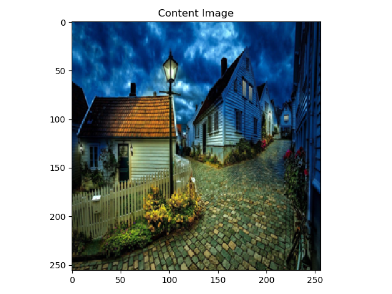
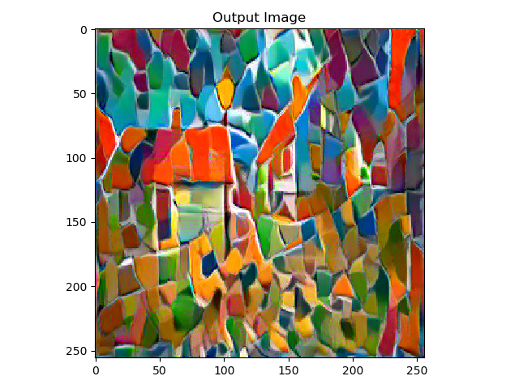

# A Comprehensive and complete tutorial guide to Neural Style Transfer in Pytorch

Style  Image            |  Content Image               | Output Image
:-------------------------:|:-------------------------:| :------------------:
  |      | 

To view the tutorial, simply open up the notebook
 
>  neural_style_transfer_in_pytorch.ipynb

The style image and content image can be changed in the *data* directory

the raw code for this tutorial without explanations and comments can be found in 

> neural_style_transfer_in_pytorch.py

